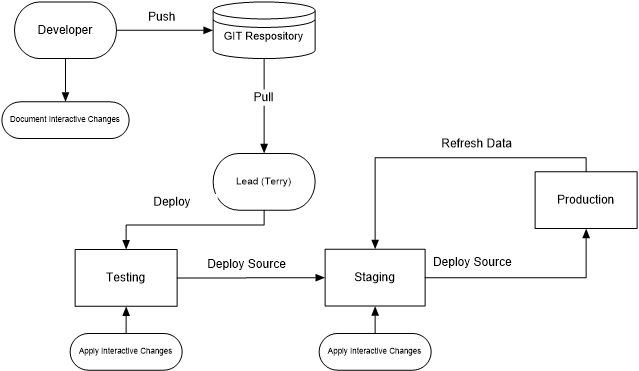

# Deployment Process
## Beginning state
Stage mirrors Testing except for database.php.

Other than source code and configuration specifically mentioned below, staging and testing mirror production.

### Environment differences

These differences must be preserved during deployments.

#### Dev
- application\config\database.php
```php
  'database' => 'austinqu_fma' // (local version)
```
- application\config\classes.ini
```ini
    [tops.mailer]
    type='Tops\mail\TDevMailer'
```
- application\config\settings.ini
```ini
    [locations]
    ; vendor folder located in project directory above document root
    ; composer='../vendor' (default)
```

#### Testing

- application\config\database.php
```php
  'database' => 'austinqu_testing'
```
- application\config\ classes.ini
  -  Email disabled:
```ini
    [tops.mailer]
    type='Tops\mail\TNullMailer'
```
  - Email enabled for testing:
```ini
    [tops.mailer]
    type='Tops\mail\TMailgunMailer'
```
- application\config\settings.ini
```ini
    [locations]
    ; vendor folder located in document root
    composer='./vendor' 
```
#### Staging

Same as testing except database:
- application\config\database.php
```php
  'database' => 'austinqu_staging'
```
### Production
- application\config\database.php
```php
  'database' => 'austinqu_fma'
```
- application\config\ classes.ini
```ini
    [tops.mailer]
    type='Tops\mail\TMailgunMailer'
```
- application\config\settings.ini
```ini
    [locations]
    ; vendor folder located in in home directory above document root
    ; composer='../vendor'  (default) 
```

## Change flow:  Dev > Testing > Staging > Production



### Development and dev testing
1. Source changes and unit tests committed to repository
2. Ready source changes submitted to Terry for review
3. Terry deploys from dev to testing
4. Testing in testing enviorment begins.

### Deploy to Staging for Test
2. Replace source changes from testing
    - vendor if needed
    - packages
    - application
        - blocks
        - assets
        - peanut
        - src
3. If database.php overwritten, change database to austinqu_staging
3. Reconcile any configuration changes.

### Refresh Staging from Prod
1. Restore database
2. Copy files from prod
    - files
    - documents
3.  Select new theme
4. Apply interactive changes<br>
   See: [CMS Updates.md](cms-updates.md)


### Final Iteration and release
1. Freeze CMS changes in prod.  Peanut changes can continue
2. Update staging from prod and testing and described above
2. Perform final tests
3. Restore CMS database tables from staging to prod.
    do not overwrite tables prefixed with 'qnut_','tops_' or 'pnut_'
3. Copy all source and config files from staging to prod
4. Update configuration
5. Replace vendor directory

