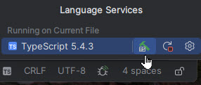
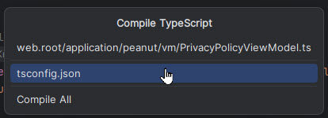

# Development Environment Setup

# The Runtime Environment

## The LAMP Stack

The acronym LAMP originally referred to Linux-Apache-MySQL-Perl.  Now it is used generically
to refer to similar combinations.  For instance most now substitute PHP for Perl, sometimes
MariaDB for MySQL, sometimes nginx for Apache.  And there are versions for OSes other than Linux. 

In our case the following services must be included:

1. Web Server: Apache or nginx.
2. PHP version 8.2 or greater.
3. MySQL or MariaDB.

These are availble in several forms, select one of the following.
- Docker image
   (ours? download info?)
- Wamp Server (Windows  only)<br>
  https://wampserver.aviatechno.net/
- MAMP for Mac or Windows<br>
  https://www.mamp.info/en/windows/
- XAMP (by Apache Friends)<br>
  https://www.apachefriends.org/download.html
- AMPPS (by Softaculous)<br>
  https://ampps.com/

# Development Tools
## Recommended Editors/IDE

### PhpStorm
Full stack PHP / Typescript development environment . Individual subscription is $99 for first year and decreases in subsequent years.  <br>
see: https://www.jetbrains.com/phpstorm/buy/?section=personal&billing=yearly

If you have an affiliation with a college or university (student, instructor...) you may be able to
obtain a free copy.<br>
see: https://www.jetbrains.com/phpstorm/buy/?section=discounts&billing=yearly

### VS Code

Visual Studio Code is Microsoft's free code editor based on Visual Studio. You can download and install
it from the Microsoft Store.  It is very capable, but you'll
need to do additional configuration for PHP and Typescript support.

- https://code.visualstudio.com/docs/languages/php
- https://code.visualstudio.com/Docs/languages/typescript

## Compilers and other Tools
Additionally you'll need these additional free tools. They can be installed individually using NPM or may
come with your development IDE such as PHPStorm.

1. NodeJS / Npm - Package manager to install other tools:<br>
   https://nodejs.org/en/download/
2. Git - Version Control<br>
   https://github.com/git-guides/install-git
1. TypeScript compiler:
   https://www.typescriptlang.org/

Optional: 
1. Composer, used to update third-party code located in the "vendor" directory:
   https://getcomposer.org/
2. SASS compiler for css files:
   https://sass-lang.com/install/

   
# Environment setup

You'll need some files stored on our web server.  We'll provide FTP credentials.

## Steps
Here are the steps you will take.
1. Install NodeJS and Git if your don't have them already
1. Download the project setup files from the web server.<br>
   - (home)/dev/setup/fma-project-start.zip
   - (home)/dev/setup/fma-dev-database.sql
   - (home)/dev/setup/application-documents.zip
1. Create a project directory
2. Extract fma-project-start.zip to your project directory.
3. Extract application-documents.zip to the application subdirectory of your project directory.
6. Check out from the Git Respository to your project root folder.<br>
   https://github.com/tsorelle/austinquakers-2019 <br>
   Branch: release-2024.2
5. If needed, install the [LAMP stack](#the-lamp-stack)
6. Configure the web server to point to your document root at (project directory)/web.root
   See [Web Server Configuration](#web-server-configuration)
7. Using PhpAdmin or other MySQL tool, execute the "fma-dev-database.sql" script to create 
    and populate the database.
12. Run a typescript compile to build the javascript. See [Compiling Typescript](#compiling-typescript).
13. Update configuration files if needed. See [Configuration Files](#configuration-files)

## Compiling Typescript

See this article for installing and configuring TypeScript<br>
https://www.typescriptlang.org/download/

If typescript is installed to run at the command line, change to the project root directory, where
    the tsconfig.json is located, and simply run "tsc".
```cmd
> tsc
```

If using PhpStorm with the bundled version of typescript, follow these steps:
1) Check your typescript configuration in <br>
    Settings > Languages & Frameworks > Typescript<br>
   For complete documentation see:<br>
   https://www.jetbrains.com/help/phpstorm/typescript-support.html
2) Open any *.ts file in the editor. And click the "TS" icon at bottom or the window, 
and click the "Hammer" icon (build).


 
3) From the "Compile TypeScript" menu, select "tsconfig.json"<br> 

    
Once you have compiled all the files, the IDE will automatically recompile individual files when
they are changed.

## Configuration files
Configuration files checked out from the repository will usually be suitable for your development 
environment.  However, here is a quick summary in case you need to make changes.

All the files discussed below are located in the \application\config folder.

### Classes.ini

The setting in this file of most concern to the developer is the "tops.mailer" section.
Developers will want a mail handler for testing that does not really send messages.

The two choices are 'TDevMailer' or 'TNullMailer'

```ini
; use null mailer to disable mail service
;type='Tops\mail\TNullMailer'
;singleton=1

; writes messages to the maildrop directory
type='Tops\mail\TDevMailer'
singleton=1
```
TNullMailer disables mail services.  It does nothing and raises no errors.

TDevMailer writes the messages to a maildrop directory where the developer can open them
in a browser to examine the contents. The directory must be created in advance. The default
location is "maildrop" in the project route.  The location can be overridden by a setting in
application/config/settings.ini. See below.

### Settings.ini
## composer
```ini
[locations]
; composer='./vendor'
```

The composer setting determines the location of the vendor folder relative to the document root (web.root).
If the setting is commented out or not present the default is '../vendor'. This is consistent with our standard
set up but if you have multiple vendor folders or use different location, you can change it.

## maildrop
```ini
[mail]
; maildrop='\dev\fma\tmp\mail'
```
By default TDevMailer writes files to the 'maildrop' directory in your project directory.  If you prefer a different 
location you can override the setting here. 

### database.php

This file is created by the ConcreteCMS installation when you enter database information. If you need to edit the
file to point to a different database, go right ahead and ignore the "DO NOT EDIT THIS FILE DIRECTLY" warning.

configuration:
```php
    'database' => 'austinqu_fma',
    'username' => 'austinqu_dba',
    'password' => 'F0xS@ysN0W@r',
    'character_set' => 'utf8mb4',
```
## Web Server Configuration

(These instructions apply to the Apache server only.)

After your LAMP stack is installed, check these Apache and PHP configuration files. You will need to point to the 
web.root directory as your document root. In the examples below we use "d:/projects/fma/web.root".  Replace this with 
the full path to web.root on your machine


There are two appoaches.

1. Change the default Document root
2. Create a virtual host (VHost)

To use the default document root, change this entry in httpd.conf:
```apacheconf
DocumentRoot "d:/projects/fma/web.root"
<Directory "d:/projects/fma/web.root">
    Options +Indexes +FollowSymLinks +Multiviews
    AllowOverride all
    Require local
</Directory>
```
Using this option you can open your dev site in a browser with:
```
http://localhost
```
The second option is especially useful if you have multiple web sites to test or if you are using localhost for other 
purposes. For example, in Wampserver localhost is used for access to several utilities.

To configure your site as a VHost...<br>
Leave the document root definition as is and add an additional <directory> section in httpd.conf:
```apacheconf
# local.austinquakers.org
<Directory "d:/projects/fma/web.root">
    Options Indexes FollowSymLinks
    AllowOverride all
    Require all granted
</Directory>

```

Make sure the following settings are enabled.

```apacheconf
LoadModule vhost_alias_module modules/mod_vhost_alias.so
# Virtual hosts
Include conf/extra/httpd-vhosts.conf

```

If you do not have a httpd-vhosts.conf file in conf/extra, create one.

Add the following settings:
```apacheconf
# localhost
# Change the path if your localhost document root is elsewhere.
<VirtualHost _default_:80>
  ServerName localhost
  ServerAlias localhost
  DocumentRoot "${INSTALL_DIR}/www"
  <Directory "${INSTALL_DIR}/www/">
    Options +Indexes +Includes +FollowSymLinks +MultiViews
    AllowOverride All
    Require local
  </Directory>
</VirtualHost>

<VirtualHost *:80>
  ServerName local.austinquakers.org
  DocumentRoot "d:/projects/fma/web.root"
</VirtualHost>
```
As a final step, update your "hosts" file. Usually found at C:\Windows\System32\drivers\etc\hosts.<br>
Add this line.
```
127.0.0.1 local.austinquakers.org
```

Once all this is complete you can your development site like this:
```
http://local.austinquakers.org
```

Note that we did not use https: as we would on a production site.  You can change this by installing open ssl on the
local web server.

## PHP Settings
Check your php.ini file for these settings:

- max_execution_time - 60 to 120
- allow_url_fopen - On
- allow_url_include - Off
- file_uploads - On
- memory_limit - 128M to 512M
- upload_max_filesize - 512M

## XDebug Installation

If you will be doing any PHP debugging you will need to install XDebug for PHP. XDebug 3 is preferred.  Many LAMP stacks 
such as WampServer come with XDebug pre-installed.  If you are not sure, open info.php in the browser and look for 
the XDebug section.  The info.php file contains just this:
```php
<?php
phpinfo();
```

For Windows use the XDebug installation wizard to generate installation instructions:<br>
https://xdebug.org/wizard

On Linux you may use the PECL PHP extension manager.  Here are instrucitons for Linux
https://dev.to/xxzeroxx/how-to-install-and-configure-xdebug-in-linux-36h8

On Mac OS you can use homebrew:<br>
https://blog.scriptmint.com/installing-xdebug-3-on-macos-and-debug-in-vs-code-912f0d728005


###

### Configure Xdebug for PhpStorm
See these instructions for PhpStorm:
https://www.jetbrains.com/help/phpstorm/configuring-xdebug.html

### Configure Xdebug for VS Code
https://dev.to/yongdev/how-to-debug-php-using-xdebug-on-vscode-3n4

## Unit Testing
Our unit tests are under (project root)/tests and are run using PHPUnit 11.5. We have included a copy of phpunit.phar, 
the PHP archive used to run phpunit, in the (project root)/bin directory.  
The "bootstrap" script that sets up the PHP environment for running our tests is tests\unit\inittesting.php

A typical command line to run the tests contained in one file would look like this:
```shell
php bin\phpunit.phar --bootstrap tests\unit\inittesting.php tests\unit\DatabaseTest.php
```
This assumes your php.exe for 8.2 is in your command serch path.  If not, include the full path, e.g.
```shell
C:\wamp64\bin\php\php8.2.26\php.exe bin\phpunit.phar --bootstrap tests\unit\inittesting.php tests\unit\DatabaseTest.php
```

### PHPStorm
The PHPUnit support in PhpStorm allows step debugging of unit tests as well as running them.
Be sure to enable the "Default bootstrap file:" and set the full path to "tests\unit\inittesting.php"

### VS Code
There are several VS Code extenions that support running and debugging PhpUnit tests.  
We have not tested these so please give us feedback on your experience if you try one of them out:
- PHPUnit Extension, Elon Mallin: <br>
    https://marketplace.visualstudio.com/items?itemName=emallin.

- PHPUnit Test Explorer, Run your PHPUnit OR Pest tests in Node using the Test Explorer UI.<br>
    https://marketplace.visualstudio.com/items?itemName=recca0120.vscode-phpunit

- Better PHPUnit<br>
  https://marketplace.visualstudio.com/items?itemName=calebporzio.better-phpunit

- VSCode-Docker-PHPUnit, <br>
  https://marketplace.visualstudio.com/items?itemName=eric-c-hansen.vscode-docker-phpunit

