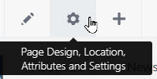
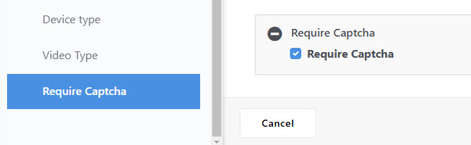

### Google Captcha

Not in use as of June 2024.  Keeping doc in case of future use.

Still evaluating and testing Google Captcha 3. Current installation plan,
if we use it is:
1. Add page attribute [Page attributes](#page-attributes)
2. Attach page attribute to pages:
    - [Contact Us](#contact-us-page)
    - [Community contacts...](#community-contacts)
    - [Mailing lists](#mailing-lists-page)

### Require Captcha
- Type: Checkbox
- Handle: require_captcha
- Name: Require Captcha
- Searchable: neither box checked
- Default Value: not checked
- Label: Require Captcha

### How to Add an Attribute to a Page
1. I edit more on your selected page and open page settings 
   
2. Find the attribute and click to add.
3. Set the attribute value.

See: [page-attributes.md](page-attributes.md)

## Contact Us page
- about-us/contact-fma 
- Set require captcha attribute 
  

## Community contacts
- Set require captcha attribute
    - community/contacts
    - community/contacts/circle-light
    - community/contacts/clerk
    - community/contacts/care-and-counsel-committee
    - community/contacts/nominating-committee
    - community/contacts/worship-and-ministry
## Mailing lists Page
- news/request-sub 
    - Set require captcha attribute
