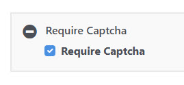

[Return to docs home page](../index.md)

# Google Recaptcha Support

Peanut includes support for Google ReCaptcha V3.<br>
See: [Google Recapcha](https://developers.google.com/recaptcha)

As implemented in Peanut, the Google API is used, rather than markup on the page,
to retrieve a decimal score indicating the probability the the "user" is a human rather than a
robot script.  We translate this to an interger between 0 an 10.  Five or below indicates
a high probability that the input is being delivered by a script.

To enable Google Recaptcha a change must be made to the head section in the theme's
header_top.php file:<br>
```php
<?php
print \Tops\sys\TRecaptcha::RenderApiTag($c);
>
```
This will create the script tag for recaptcha if the page requires it.  This requirement
is indicated using the "Require Captcha" page attribute:<br>


The Google API keys needed are stored in the application\config\google.ini file:

```ini
[recaptcha]
site='(site key here)'
secret='(secret key here)'
```

The Peanut.Recaptcha class handles the operations needed in the view model. 

At the top of the view model file, place this reference. Adjusted for the relative location
of your view model.
```typescript
/// <reference path='../../../../pnut/js/Recaptcha.ts' />
```

Declare a variable for your recaptcha object:
```typescript
 recaptcha: Peanut.Recaptcha;
```

In the init() function, include '@pnut/Recaptcha' in a loadResources call.  Once the
script loading completes you will make a service call to get the Google reCAPTCHA site key. 
If this is all you need for the initialization you can use the "Peanut::GetRecaptchaSiteKey"
service command.

```typescript
init(successFunction?: () => void) {
    console.log('TestRecaptcha Init');
    let me = this;
    me.application.loadResources([
        '@pnut/Recaptcha'
    ], () => {
        me.recaptcha = new Peanut.Recaptcha();
        me.services.executeService('Peanut::GetRecaptchaSiteKey',null,
            function(serviceResponse: Peanut.IServiceResponse) {
                if (serviceResponse.Result == Peanut.serviceResultSuccess) {
                    let ready = serviceResponse.Value != 'none';
                    me.recaptcha.setSitekey(serviceResponse.Value)
                    // other initializations...
                    me.bindDefaultSection();
                    successFunction();
                }
            }
        );
    });
};

```
Many view models already make a call to get initialization items. You can return the key in 
the response as in the following example. If the user is authenticated, no captcha is needed 
so we set the site key as 'none' otherwise we call TRecaptcha::GetSiteKey(), 
and place the resulting value in the response.

```php
use Tops\sys\TRecaptcha;
use Tops\sys\TUser;
```
```php
$response->grsitekey ='none';
if (!TUser::getCurrent()->isAuthenticated()) {
    $response->grsitekey = TRecaptcha::GetSiteKey();
}
```
Back in the view model set the sitekey in the recaptcha object.

You'll no doubt have a button on the form to launch an action that you want protected
by captcha. The event handler for this button should look something like this.

```typescript
    onRecaptchaSubmit = () => {
        this.recaptcha.submit(this.getRecaptchaResponse);
    }
```
In this case, getRecaptchaResponse is a seperate funtion that recieves a "token" parameter:

```typescript
getRecaptchaResponse = (token: string) => {
    let me = this;
    . . .
}
```
You can make a seperate function or just include it inline as in this example from ContactFormViewModel.ts:
```typescript
        sendMessage = () => {
            let me = this;
            // validate the form and get the request first.
            let message = me.createMessage();
            if (message) {
                // then if valid, call recaptha.submit
                me.recaptcha.submit((token) => {
                    if (message) {
                        // include the token in the request to your service call
                        message.token = token;
                        me.services.executeService('peanut.Mailboxes::SendContactMessage', 
                            message, function (serviceResponse: Peanut.IServiceResponse) {
                                // the service will check verify the recaptcha token
                            }
                        );
                    }
                });
            }
        }
```
Include this code in your service command:
```php
use Tops\sys\TRecaptcha;
```
```php
protected function run()
{  
    $message = $this->getRequest();
    if (!empty($message->token)) {
        $verification = TRecaptcha::Verify($message->token);
        if ($verification < 7) {
            $this->setError('Recaptcha verification failed');
            $this->setReturnValue('denied');
            return;
        }
    }
    // continue process...
}
```
The TRecaptcha::Verify() function return a number 0 to 10 indicating the probability
that the input came from a person rather than a robot.

Usually, real persons produce a result of 9 or 10.  A result of 5 usually indicates a robot.
You can adjust this threshold to me more or less cautious depending on the sensitivity of the access.

If the score is too low, indicate the failure with either
the setError or showError methods, and skip the rest of the 
process.
