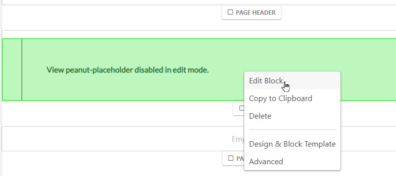
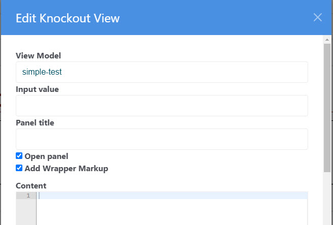

[Return to docs home page](/peanut/docs)

# Knockout View: ConcreteCMS block

## Inserting a viewmodel on a ConcreteCMS page
First, of course we must create the viewmodel and associated configuration as described in 
[View Models and Views](../peanut/viewmodels-views.md)

Once we have a viewmodel, we can installing on our ConcreteCMS with the "Knockout View" block. The
block can be placed on any page along with other content.  Multiple viewmodels can
be placed on a page. For more information see (Multiple Viewmodels)[multiple-viewmodels.md].

Most viewmodels produce the entire content for the page. We provide the "Peanut Host Page"
page type for convenience.

After dropping the block on the page, edit the block:


Enter the viewmodel identifier in the "View Model" field.  This must correspond
to an entry in your viewmodel.ini file. This is all that is required in most cases.
The section below explains the optional fields.

### Fields in Knockout View Block

- **View Model**: the view model identifier.
- **Input value**: a value that may be used by a Service Command executed by the
  viewmodel. See  [Service Commands](../peanut/service-commands.md)
- **Panel Title and Open panel**:<br>
  These are used by the "Collapsible Knockout Panel" custom template when
  applied to a knockout view block. See: [Templates and Styles.md](templates-and-styles.md)
- **Add Wrapper Markup**: when checked, alls markup that adds HTML markup give
  the output margins and padding to match the page. Uncheck if you want the
  output to cover the entire width of the window, or if you have include
  special enclosing mark up in the view.
- **Content**: HTML markup placed here can be used in place of a view file. If
  you want this, add "view='content'" to the viewmodel.ini entry.

```ini
[simple-test]
vm=tests/SimpleTest
view=content
```
## Behind the Scenes

This is all it takes to install a viewmodel in your ConcreteCMS page. But, a lot is going on to make your
view model presentation appear as if by magic.  If you want to know how the magic is done, see:<b>
[Peanut Startup Sequence in ConcreteCMS](startup-sequence.md)