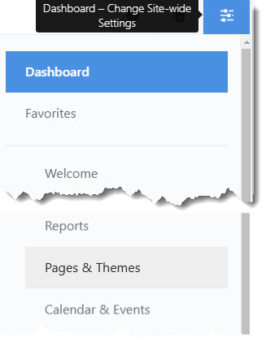
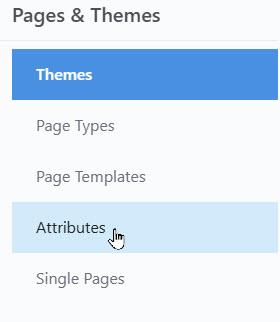
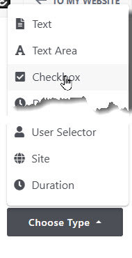

# Page Attributes
First here are general instructions for how to add an attribute. 
### How to add an attribute
1. Open the "Dashboard" and Select "Pages and Themes" 
    
2. Select "Attributes" 
    
3. Select the attribute type 
    