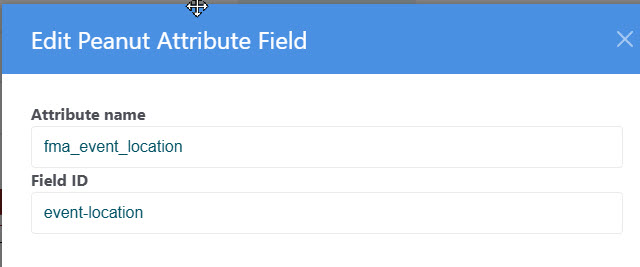
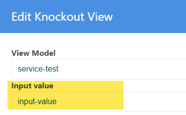
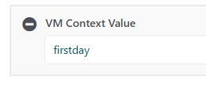
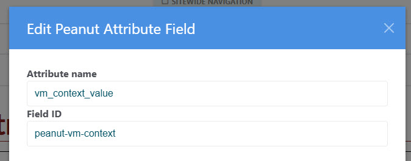
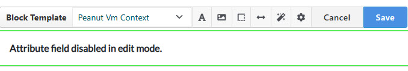
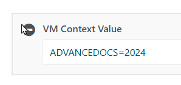

[Return to docs home page](../index.md)

# Peanut Attribute Block

The Peanut Attribute Block is used to store page attribute values in a hidden input
element on the page, usually to be sent to a service command. The purpose of this is
to free the service command from having to use ConcreteCMS specific code to retrieve
attribute values.  That way the service command can be used in non-concretecms installations.

A simple demonstration can be found in the test page: peanut-attribute-test. The code is 
in:
- web.root/application/peanut/tests/vm/PeanutAttributeTestViewModel.ts
- application/peanut/tests/view/PeanutAttributeTest.html

The block has two fields:<br>


- Attribute name is the name of an attribute attached to the page.
- Field ID is the id of the of the input field that the block will create.

The block retrieves the attribute value and creates the input in this form:
```html
   <input type='hidden' id='event-location' value='meeting house' >
```
You can use the view model convenience funciton getPageVariable() to retrieve the value:
```typescript
let location = this.getPageVarialble('event-location');
```
## Vm Context

This view model method will return a code composed of any shared context value (see below)
and the id of the Knockout View block.

```typescript
let context = this.getVmContext()
```
You can place this value in a request sent to a service command, then the command can use the id
to get the "input" field value placed in the block:<br>


The "View Model Context" can also include a value shared in common by multiple blocks on the page 
that may be used as an input parmeter to a service command.  Such is the case with our committee pages. 
Each of these pages has three blocks that need to send a committee code to retrieve data 
from the services.  The value is obtained by a hidden input on the page:

In the ConcreteCms version you can use the Peanut Attribute Block to create the hidden input that stores this value.
This allows us to create page types like "Committee Page" with the VmContext Attribute:<br>
<br>

The Peanut Attribute Block defaults to the settings for the VM Context Value:<br>


So you can simply drop the block on the page and retrive the value with the getVmContext() 
function.

See the service-test page for an example. Source:<br>
application/peanut/tests/vm/ServiceTestViewModel.ts

Then in the service command class use the TvmContext:GetContext() function to
decode the vm context value. As in this example:<br>
```php
$context = TVmContext::GetContext($request->contextValue ?? null);
```
This returns a data structure (stdclass) like this:
```php
{
   viewmodel // name of the view model
   value     // from the block input field
   shared    // from context value
   // if value or shared are blank both are set to the same value 
}
```
### Peanut VM Context Template
Earlier versions, such as SCYM.org, did not use the Peanut Attribute Field block. Rather
an HTML block with a custom block template: "Peanut Vm Context" is used  This does the
same thing but is slightly more complicated to use.  The steps are:

1. Place an HTML block on the page.  It need have no content at all but typically we put
in a place holder comment:
```html
<!-- Place holder: Block content populated by Peanut VM Context block template -->
```
2. In 'Design and Block Template', select the 'Peanut VM Context' block template.
<br>


This technique is available in all versions, but use of the Peanut Attribute Field block is
preferred.

In SCYM, a frequent use case is on a page containing a "document-list" view model, to
filter advance documents for a specific Yearly Meeting:<br>

