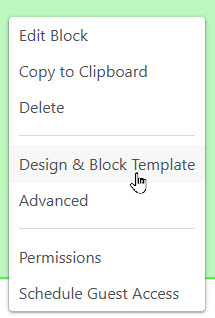
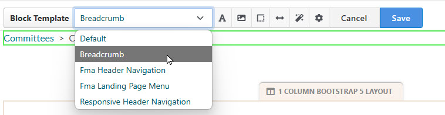
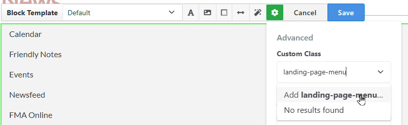

[Return to docs home page](../index.md)
# Templates and Styles

[Home](../index.md)

In Concrete CMS one may use the "Design & Block Template" menu to apply customizations of
block behavior and appearance.  

Important things you can do:
1. Apply a template. 
2. Apply a custom CSS class.
3. Change margins, padding and other styling properties.

On our site we make extensive use of templates and CSS classes which are defined in our theme.  
The "manual" styling items (#3 in the list) are occasionally useful for quick fixes, but use of 
stylesheets is the preferred alternative since these styles can be applied across the site 
and are subject to version control.

In edit mode, start by clicking the block and select "Design and Block Template" 

## Block templates

The  "Block Template" feature allows us to override default behavior of blocks. Templates may
be provided by ConcreteCMS, third-party packages and our own code. 

For a complete list of templates used in our website, see: ["Where's the Code?"](wheres-the-code.md)

## Css Custom Classes

When in the "Design and Block Template" dialog, you may add a 
custom class.  Click the "cog" icon, and enter the class name under
custom class. Remember to click "Add (class name)..." befor you click 'Save'

These custom classes are commonly used on our site:
  - landing-page-menu - formats an autonav block to appear as a menu
  - landing-page-list - formats a page list block as a landing page menu.
    Use the page list if you want page descriptions to appear.
  - pnut-basic-pagelist - simple format for page lists.
  - fma-group-page-list  - format for collapsible page list on group pages

## References:
 - [How to Override almost any Core File in ConcreteCMS](https://documentation.concretecms.org/tutorials/override-almost-any-core-file-concrete-cms)
 - [Creating a Custom Template](https://documentation.concretecms.org/9-x/developers/working-with-blocks/modifying-default-view-template-core-block-type)

