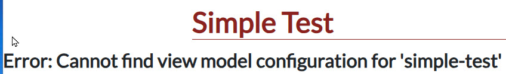
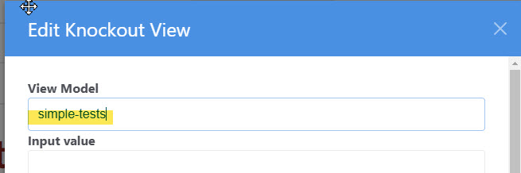
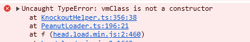
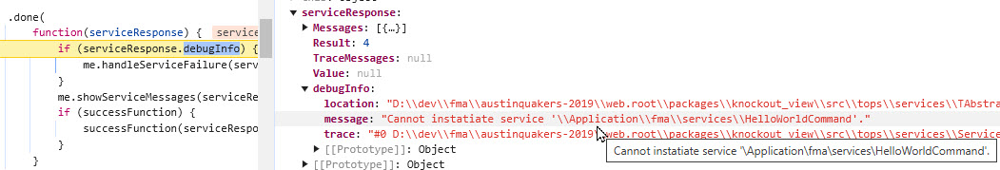
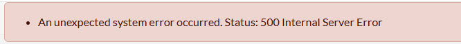
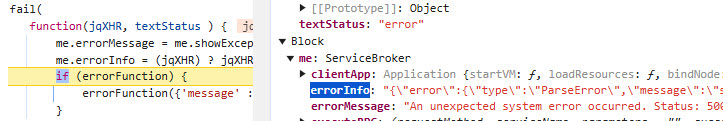

[Return to docs home page](../index.md)

# Trouble Shooting

Here are some tips on how to trouble shoot some very cryptic 
error message you might see.

For more tips about debugging problems, see [Debug with Browser.md](../peanut/debug-with-browser.md)

## PHP Error cannot get file contents of HTML file

```
Whoops \ Exception \ ErrorException (E_WARNING)

file_get_contents(D:/dev/fma/austinquakers-2019/web.root/application/peanut/tests/view/SimpleTests.html): 
Failed to open stream: No such file or directory
```
Can't download the view HTML file. Could be a spelling mistake in viewmodels.ini
```ini
[simple-test]
vm=tests/SimpleTests
```
Should be "SimpleTest" not "SimpleTests!

## Error messge in CMS: Cannot find view model configuration


Another viewmodel.ini error. The section header doesn't match the viewmodel value in the Knockout View block.

```ini
[simple-tests]
vm=tests/SimpleTests
```
"[simple-tests]" should be "[simple-test]"

Or it was misspelled in the Knockout Block:



Check the source files too, they should be spelled correctly and in the correct location

- Viewmodel: vm/tests/SimpleTest.ts
- View:      view/tests/SimpleTest.html

Incorrect casing will cause this issue on UNIX/Linux systems.

## Some class name is not a constructor message

You may see something like this in the JavaScript console:



Usually this means that the class name in the viewmodel file does not match the file name.

If in SimpleTest.ts, you have...

```typescript
    export class SimpleTestsViewModel  extends Peanut.ViewModelBase {
```
This would fail because the loader would find the 'SimpleTestViewModel.js' but the 
'SimpleTestViewModel' class cannot be instantiated because it was misspelled.

## Cannot Instantiate Service

Oh no!


This is dreaded because it tells us nothing about the error.  It means that the client was not able
to find and execute the service command at all.  But the issue is usually pretty simple.

We'll need more information so, with the debugger in your browser, 
set a break point in the ServiceBroker.ts.  This technique is described in detail in
[Debug with Browser](../peanut/debug-with-browser.md).



The "Cannot instantiate service" error most often means a spelling error in the file name or 
the PHP service class. Did you follow the naming conventions?

In this example, the file is named "HelloWorldCommand.php" which is correct but the class name
does not match:
```php
class HelloWorld extends \Tops\services\TServiceCommand
```
It lacks "Command" on the end of the name.

## PHP errors

Oh my! This looks bad.



Calm down, this is even easier to diagnose that the previous example.

If we set our JavaScript breakpoint in the fail() funtion of executeRPC() we can examine the
debugInfo object.




DebugInfo contains a detailed error dump that will reveal
a code problem such as a syntax error and show you exactly where to find it.

In this case...
```php
uses Peanut\sys\TVmContext;
```
Should be "use" not "uses".

## Binding Container Not Found

Well, this is bewildering.  The view model just never renders. Nothing shows up!

Check the JavaScript console.


Container element ... for section binding not found, means that your view html
file lacks a div that is used to bind the view model.

```html
<div id="simpletest-load-message"><span class="fa fa-spinner fa-pulse fa-2x" style="color:lightgrey"></span></div>
<div id="simpletests-view-container" style="display:none" class="col-md-12 pb-3" >
```
See, the div id "simpletests-view-container" is misspelled. It should be
"simpletest-view-container" as indicated in the console message.
