[Return to docs home page](../index.md)
# Debugging with browser developer tools
Note: This doc was prepared using the Edge browser. The developer
tools in Chrome are very similar.

Suppose you get a mysterious error message like this one. Perhaps it only occurs
in deployment.  

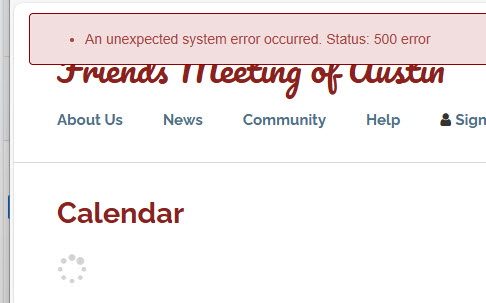

Here's how to find where problems occur in a call to one of our ServiceCommand classes:

(note: For more about the Service Command objects see: [Service Commands](../peanut/service-commands.md))

Press F12 to open developer tools. These examples are in Edge but Chrome is 
very similar.

Click the "Sources" tab.

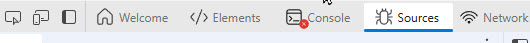

Browse the sources tree to find Services.ts or Services.js.

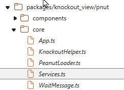

In the source pane, find ServiceBroker.executeRPC

Set breakpoints in the .done and .fail functions. This will usually be on 
lines 220 and 232:

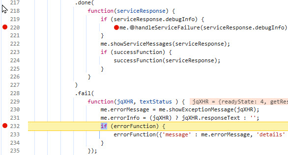

Refresh and one of these two breakpoints should be hit.  

## Service Errors
If you see one of these messages: 
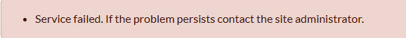 

It is likely the your debugger will break in the ".done()" function. 
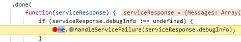 

The .done function executes when a service call successfully executes.  However
if the service catches an exception, the information you need is returned in
serviceResponse.debugInfo object: 

In the right panel, under "Scope" and "local", expand the "serviceResponse" object: 
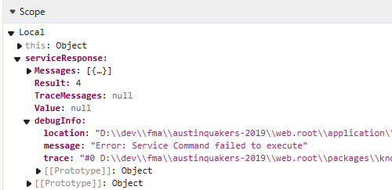 

The "message" property may tell all you need to know. The "trace" property contains all the detail.
If you need this, right click "trace" and select "Copy string contents". 
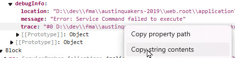 

## System Failures

The .fail function will execute if there is a low level exception such as when a syntax
error causes a PHP script not to execute.  You will typically see this message: 
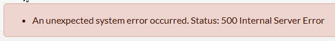

You should, in this case, hit the breakpoint in the fail() function: 
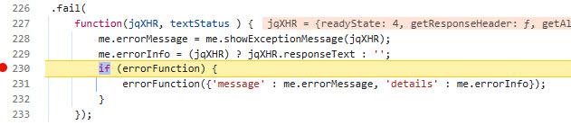

Go to the right pane, look under the scope section and find: 
Local > jXHR > responseJSON > error. The file, line and message properties may tell you all you need to know. But if you need more,
right click "trace:" and select "Copy Object" 
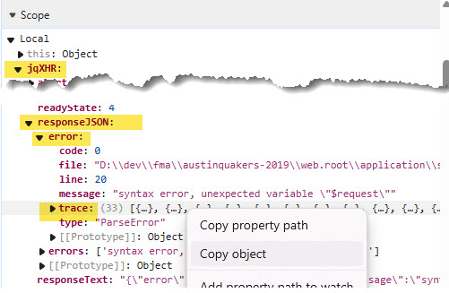 

Paste into a text file and you'll find very detailed information about the error, 
which may show the way to resolution in your development environment:

