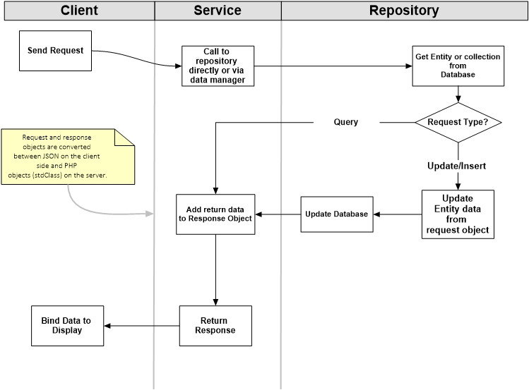
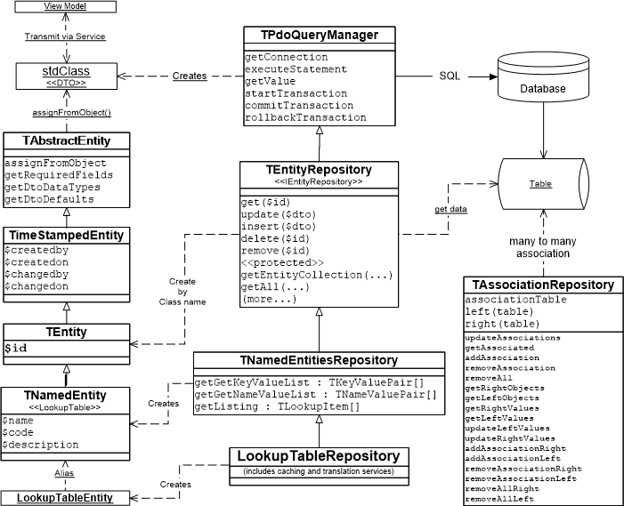
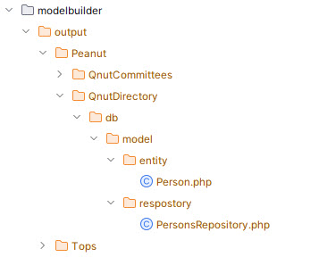

[Return to docs home page](../index.md)

# The Peanut Data Access

## The Lightweight ORM

Database operations in peanut are handled by a set of related classes that we call the lightweight ORM.  It is probalbly
overblown to call it an object relational managment system, because it does not model relations between table classes.
It is simply comprised of:

1. Entity classes, that represent the data structure of a table and serve as data transfer objects, DTOs.
2. Repository classes, that perform an operations aganist an single table or small set of related table.

Each Entity/Repository class is related to a database table.  Fetch operations return an entity object or
collection. A repository may also perform "free form" queies that return stdClass objects.

There is a third kind of class, the "Data Manager" class that typically contains multiple repositories and handles
relationality in the model.  There are no specially definded super classes or abstract classes for these. They simply
follow the pattern.   See the Peanut\QnutDirectory\db\DirectoryManager class for a robust example.

Starting class definition code for Entity and Repository classes can be generated using the Model Builder application
found in dev-tools/modelbuilder.  Details follow.

## PHP Data Objects (PDO)

Repository classes perform database operations based on the PHP PDO framework.  PDO is expecially suited to object oriented
applications for its ability to return collections of class based objects or untyped stdClass objects as the result of SQL queries.
PDO has other advantages such as its efficient parameterization of queries to protect against SQL injection.

For a full description see: PHP Data Objects https://www.php.net/manual/en/book.pdo.php .

The developer will frequently be called upon to use particular features of PDO.  Here is a quick introduction.

In order to perform a SQL query, we need to do the following.

1. Establish a database connection by creating a new PDO object.
2. Given a SQL statement, as a string with replaceable prameters (optionally), prepare a SQL query using the
   prepare($sql) method on the connection object.  This returns a PDOStatement object. 
   See [PDO::prepare](https://www.php.net/manual/en/pdo.prepare.php).
3. Call the execute($parameters) method on the statement object, optionally passing in an array of parameter vaiues.
   See [PDOStatement::execute](https://www.php.net/manual/en/pdostatement.execute.php).
4. If the query returns data, call the fetch($mode) (or fetchAll, fetchObject...) method on the statement. The mode parameter 
   determines how PDO returns the row or value. Typically we use one of the following:
   - PDO::FETCH_OBJECT: Returns a new instance of an untyped object (stdClass)
   - PDO::FETCH_CLASS: returns a new instance of the requested class
   - PDO::FETCH_COLUMN: returns value of first column

In our applictions, base repositories and other data access classes encapsulate steps 1 to 3 and sometimes 4 as well.
The task of the programmer is to write the SQL and provide parameters as an array.  Typically we use "?" as the 
replacement token in the SQL.
 Here is a typical example from a repository class:

```php
    $sql=
        'SELECT leadDays FROM qnut_notification_subscriptions s '.
        'JOIN qnut_notification_types t ON s.notificationTypeId = t.id '.
        "WHERE personId = ? AND s.itemId = ? AND t.code = 'calendar'";

    $stmt = $this->executeStatement($sql,[$personId,$eventId]);
    $result = $stmt->fetch(PDO::FETCH_COLUMN);
```
In this case TPdoQueryManager::executeStatement, performs steps 1 through 3.  The programmer provides the SQL and the 
two parameters.  The executeStatement() call returns a PDO statement object.  We then call the fetchMethod with the mode
parameter of PDO::FETCH column so as to obtain a single return value from the "leadDays" column.

In the next example we select a single record based on a lookup column. 

```php
    $sql = 'SELECT e.id,e.code,e.name,e.description FROM qnut_email_lists e WHERE  `code` = ?';
    $stmt = $this->executeStatement($sql,[$code]);
    return $stmt->fetch(\PDO::FETCH_OBJ);
```
This returns a single untyped object (stdClass)

This one retrieves a collection of objects.
```php
    $sql = "SELECT id, personId, reportedDate, address,  ".
        "IFNULL(`name`,'(unknown)') AS `name`, '' AS correction, null as restore, null as remove, null as invalid, ".
        "IF(personId IS NULL,'0', CONCAT( '%s',personId)) AS personLink ".
        "FROM `qnut_email_corrections` WHERE `errorLevel` = ? AND active=?";

    $sql = sprintf($sql,$personFormUrl);

    $stmt = $this->executeStatement($sql,[1,1]);
    return $stmt->fetchAll(PDO::FETCH_OBJ);
```
In the last two examples, we need to construct a SQL query and use PDO::FETCH_OBJ to select untyped objects because the
structure of the results we need do not match any defined entity class. More often we can use repository classes which
uses PDO::FETCH_CLASS to return instances of our strictly typed entity classes.  DML functions, update,delete,insert are
typically handled by repositories without explicitly defined SQL.

More about this follows.

## Common Patterns

The repository classes are designed to work with strongly typed Entity classes but can receive and return data in any
form. For "free form" data results, an untyped PHP Class, stdClass, is used.

Here we describe the typical flow of a data request. The actors in this scenario are:

- Client: A viewmodel running in the client browser.
- Service: a PHP TServiceCommand object on the web server.
- Repository: a repository object also on the server side.

A manager object is frequently used as an intermediary between Service and Repository but is ommitted from the diagram
for simplicity sake.

Data is exchanged between these actors in the form of Data Transfer Objects (DTO).  These may take the form of an untyped
PHP object, stdClass, or a more strongly typed Entity object.  On the client, these objects are created as JSON objects.

Input and return data passing between client and server is bundled into DTO packages called Request and Response objects.

A typical scenario is described in the diagram.  

1. Requests origniate from the client which may contain an entity Id value, 
the primary key, for selection or a DTO object matching the entity data structure for inserts and updates.

2. The Service recieves the Request packet and extracts the Id or DTO.  A Repository is created and method on the Repostory
is called to perform the job.

3. Using the Id, either sent as a single value or as part of the DTO, the repository retrieves the corresponding Entity
object.

4. If the request is for an insert or update operation, the Entity->assignFromOject(DTO) method is used to update
any member data in the Entity object that has changed.  Then uses a method such as insert(Entity) or update(Entity) 
to update the database.

5. On return, the Service bundles the selected or updated data into a Response object to be returned to the client.

6. In the transition back to the client, the response is converted to JSON.  The client then binds the data to the display.

This is a very common scenario but by no means the only variation. There is a wide variety of uses but this should 
serve as a demonstration of basic principles.



## Class Model

### Entity and Repository Class Hierarchy

Entity and Repository classes are designed to work in pairs that match the data structure of a particular table in the 
database.  A parallel hierarchy of base classes is provided for typical structural patterns.  

The base classes provide all the fundamental connection management, data access and manipulation methods. Subclasses extend 
these to match specific tables, and add additional specialized data operations. We use the ModelBuilder application to
generate entity and repository classes that accurately mirror their table's data structure.  See [Model Builder](#model-builder).

This diagram describes the class model for the base Entity and Repository classes.  Note that there is one more specialized
class, TAssociationRepository that handles queries and updates to many-to-many associations, referencing left and right
tables, with an id primary key, and an association table the tracks the key pairs that define the relationship.

A more detailed explanation follows the diagram.



Entities descend from an abstract class:
```php
abstract class TAbstractEntity
```
This class mostly provides facilities to copy data from an untyped DTO which would typically be recieved by a service to
use in insert/update operation. Examples will follow.

An important subclass is...
```php
class TimeStampedEntity extends TAbstractEntity
```
This class models tables that include timestamp information and handles updates of date and time for insert and update events
```php
    public $createdby;
    public $createdon;
    public $changedby;
    public $changedon;
```

The TEntity class adds an autoincremented primay key (int $id) and an active flag which is used to hide records in the 
application rather than to actually delete them.  This is the pattern for the most important tables in the database

```php
class TEntity extends TimeStampedEntity
```

The NamedEntity class is typically used for lookup tables containing a selection of values associated with a column in another table. 
See `qnut_document_types` or `qnut_email_lists`

```php
class NamedEntity extends TEntity
```

NamedEntity provides some convenience methods for getting/setting values.  LookupTableEntity is a simplified version with
data members only.  In either case the following columns are added to TEntity

```php
    public $name = '';
    public $code = '';
    public $description = '';
```


The data structure of the majority of tables are represented by descendants of these entity classes.  Starter code for 
these class definitions cam be generated using the "Model Builder" application. 

### Repositories and other Data Access Classes


#### Database 
The TDatabase class is used by repositories and other classes to handle database connections and configuration.  

```php
class TDatabase
```
In ConcreteCMS, TDatabase uses the ConcreteCMS configuration file for database and server specifications,
/application/config/database.php. The usual Peanut configuration file is database.ini.  Peanut supports the use of multiple
databases in the same applications, where ConcreteCMS does not. If you want multiple database support, use the database.ini file
and disable the tops.connections entry in classes.ini.

```ini
; enable this for all ConcreteCMS versions,  otherwise database.ini is used
[tops.connections]
type='Tops\concrete5\Concrete5ConnectionManager'
```

TDatabase provides a few standalone SQL operations:

```php
    public static function ExecuteSql($token, $script, $connection=null) {/*Run SQL Script*/}
    public static function tableExists($tableName, $connection=null) {/*Check if table exists*/}
    public static function rowCount($tableName, $connection=null)    {/*Get total row count in a table*/}
```

TDatabase is used by a few classes that provide general SQL operations, unrelated to repositories, such as TQuery:

```php
class TQuery
```
The TQuery class is used to execute ad hoc queries, and is primarily used in tests and scripts. It has a similar set 
of data access funtions to the repository classes.  Here's a typical example:

```php
    $this->query = new TQuery();
    $stmt = $this->query->executeStatement('select * from migrate_documents');
    $docs = $stmt->fetchAll(\PDO::FETCH_OBJ);
```


### Repository classes

The TPdoQueryManager is an abstract super class for all repositories and some other database related classes.

```php
abstract class TPdoQueryManager
```

It provides basic SQL operations such as these:
```php
    /**
     * Prepare and execute a PDO statement
     * @param $sql
     * @param array $params
     * @return PDOStatement
     */
    protected function executeStatement($sql, $params = array());

    /**
     * Execute a PDO statememt to return a single numeric value 
     * @param $sql
     * @param $params
     * @return false|mixed
     */
    public function getValue($sql, $params = array()) ;

    /**
     * Begin a transaction
     */
    public function startTransaction();

    /**
     * End a transaction
     */
    public function commitTransaction();

    /**
     * Roll back a transaction
     */
    public function rollbackTransaction();

```

#### Entity Repositories

Most repository classes descend from TEntityRepository:

```php
abstract class TEntityRepository extends TPdoQueryManager implements IEntityRepository
```

This class supports the common database "CRUD" methods and automatically updates timestamp columns.  Here are the 
essential methods.  See comments and code for more details, helper methods and less frequently used methods.

```php
    /**
     * Subclasses return a list that defines the data structure.
     * You can use "ModelBuilder" to generate this function for a given table.
     */
    protected abstract function getFieldDefinitionList();

    /**
     * return full class name for associated entity class.  Used to instatiate objects returned
     * by queries. You can use "ModelBuilder" to generate this function for a sub-class.
     */
    protected abstract function getClassName();

    /**
     * return name of associated table
     * You can use "ModelBuilder" to generate this function for a sub-class.
     */
    protected abstract function getTableName();

    public function getLastErrorCode();

    /**
     * @param $id
     * Return single instance of the associated Entity class selected by id
     */
    public function get($id)

    /**
     * Execute a select query returning a collection of instances of the associated entity class.
     * Return PDO statement. The "fetch" instruction to retrieve the result must be invoked by the calling method
     */
    protected function executeEntityQuery($where, $params, $includeInactive = false,$orderAndLimit = '')
    
    /**
     * This replaces getSingleEntity, when clauses are to be included.
     * Did not want to mess with getSingleEntity for backward compatibility reasons
     */
    public function getSingleInstance($where, $params, $clauses='', $includeInactive = false)
    
    public function getRecordCount($condition,$params, $includeInactive=false) {
    
    public function getCount($includeInactive=false, $where='', $clauses='') {
    
    /**
     * Return a single instance of associated entity class based on SQL conditionals and parameters
     */
    public function getSingleEntity($where, $params, $includeInactive = false)

    /**
     * Return a collection of instances of the associated entity class based on SQL conditionals and parameters
     */
    protected function getEntityCollection($where, $params, $includeInactive = false)


    /**
     * Update table based on entity object
     */
    public function update($dto, $userName = 'admin')

    /**
     * Insert values from entity object
     */
    public function insert($dto, $userName = 'admin')

    /**
     * Return all records as instances of the associated entity class
     */
    public function getAll($includeInactive = false,$orderField=false)
    public function getAllSorted($orderField)

    /**
     * Delete record by entity id
     */
    public function delete($id)

    /**
     * Delete record(s) by foreigh key
     */
    public function deleteByForeignKey($key,$value,$filterCondition = null) {

    /**
     * Set 'active flag' to false
     */
    public function remove($id)

    /**
     * Change active flag to true
     */
    public function restore($id)

    /**
     * Return single instance of associated entity by id or other key
     */
    public function getEntity($value, $includeInactive = false, $fieldName = null)

    /**
     * Return single instance of associated entity by globally unique id
     */
    public function getEntityByUid($value, $includeInactive = false)

    /**
     * Return value of one field for id
     */
    public function getFieldValue($fieldName,$id) {

```

### Use Examples

Calls to Repository methods are typically found in repositories, service classes and manager classes.

From UpdateEventCommand (service), where request is an object mirroring the entity recieved from a view model.

```php
        $repository = new EmailListsRepository();
        $isNew = ($request->id === 0);
        $list = $repository->getEntityByCode($request->code,true);
        $list->assignFromObject($request);
        if ($isNew) {
            $repository->insert($list,$this->getUser()->getUserName());
        }
        else {
            $repository->update($list,$this->getUser()->getUserName());
        }
```

From PersonsRepository, use an ad-hoc query to select a partial record by foreign key from a related table. 

```php
        $sql = 'select organizationId,roleId from qnut_person_affiliations WHERE personId=?';
        $stmt = $this->executeStatement($sql,[$personId]);
        $result = $stmt->fetchAll(PDO::FETCH_OBJ);
```

Get a lookup list as a collection of TLookupItem objects.
```php
        $sql =
            'SELECT r.id, r.code,r.name,r.description FROM qnut_resources r '.
            'JOIN qnut_calendar_event_resources e ON r.id = e.resourceId WHERE e.eventId = ?';
        $stmt = $this->executeStatement($sql,[$eventId]);
        $result = $stmt->fetchAll(PDO::FETCH_CLASS,'Tops\sys\TLookupItem');
        return $result;
```
From PersonsRepository, get a list of persons residing at the same address:
```php
        $whereClause = "addressId = ? AND deceased is null";
        if ($excludeOptOut) {
            $whereClause .= ' and listingtypeId <> 0';
        }
        return $this->getEntityCollection($whereClause,[$addressId],$includeInactive);
```

#### TAssociationRepository

This class is used to model many to many relations, such as mailing list subscribers/subscriptions.  The constructor enables
you to create a repository on the fly or it can be used as a base class.

For an instructive example see SubscriptionAssociation and EmailSubscriptionAssociation.

### Manager classes

Manager classes are a stereotype, there are not abstract of based classes defined for these.  They typically use
multiple repository classses to coordinate related tables.  See these examples ind /pnut/packages/qnut-directory/src/db

- DirectoryManager.php
- DistributionListManager.php
- EmailManager.php

## Namespaces and source locations

By convention, database files are located under a "db" subdirectoy beneath a directory mapped to a root namespace dirctory
or sometimes a secondary namespace dirctory. In peanut packages, the 'db' subdirectory is just below the package/src directory.

Examples:

| Namespace               | Path in ConcreteCMS                             |
|-------------------------|-------------------------------------------------|
| Tops\db 	               | packages/knockout_view/src/tops/db/ |
| Application\fma\db 	    | application/src/fma/db                     |
| Peanut\QnutDirectory\db | packages/knockout_view/pnut/packages/qnut-directory/src/db     |

The different kinds of classes are then found in subdirectories as follow:

| Class type                 | Subdirectory        | 
|----------------------------|---------------------|
| Managers and other classes | db                  |
| Entity                     | db/model/entity     |
| Repository                 | db/model/repository |

Examples:

| Namespace\class                              | Source Location                                                             |
|----------------------------------------------|-----------------------------------------------------------------------------|
| Tops\db\model\entity\Process                 | packages/knockout_view/src/tops/db/model/entity/Process.php                 |
| Tops\db\model\repository\ProcessesRepository | packages/knockout_view/src/tops/db/model/repository/ProcessesRepository.php |
| Peanut\QnutDirectory\db\DirectoryManager     | packages/knockout_view/pnut/packages/qnut-directory/src/db/DirectoryManager.php |
| Peanut\QnutDirectory\db\model\entity\Person  | packages/knockout_view/pnut/packages/qnut-directory/src/db/model/entity/Person.php |
| Peanut\QnutDirectory\db\model\repository\PersonsRepository | packages/knockout_view/pnut/packages/qnut-directory/src/db/model/repository/PersonsRepository.php |


## Model Builder

Model Builder is a mini-application using a PHP command line script, dev-tools/modelbuilder/create-model.php
to generate entity and repository classes.

### Data structures

Start by creating one or more tables in the database.  These must have a primary key id column and in most cases an active
column.  For a timestamped entity also include timestamp columns.  For a lookup table inclde code (unique key),name and description.
Tables must include a prefix such as qnut_, tops_, pnut_, or fma_.

#### Required colummns for Entity Types

Most entity classes derive from a sub-class of T

An example lookup table:

```sql
CREATE TABLE `qnut_document_types` (                                                                                                                                                                                                                                                                                                                                                                                                                                                                                                                                                                                                                                                                                                                                                                                                 
  `id` int unsigned NOT NULL AUTO_INCREMENT,                                                                                                                                                                                                                                                                                                                                                                                                                                                                                                                                                                                                                                                                                                                                                                                         
  `code` varchar(64)  NOT NULL,                                                                                                                                                                                                                                                                                                                                                                                                                                                                                                                                                                                                                                                                                                                                                      
  `name` varchar(128)  NOT NULL,                                                                                                                                                                                                                                                                                                                                                                                                                                                                                                                                                                                                                                                                                                                                                     
  `description` varchar(256)  DEFAULT NULL,                                                                                                                                                                                                                                                                                                                                                                                                                                                                                                                                                                                                                                                                                                                                          
  `createdby` varchar(64) NOT NULL DEFAULT 'system',                                                                                                                                                                                                                                                                                                                                                                                                                                                                                                                                                                                                                                                                                                                                
  `createdon` datetime DEFAULT CURRENT_TIMESTAMP,                                                                                                                                                                                                                                                                                                                                                                                                                                                                                                                                                                                                                                                                                                                                                                                    
  `changedby` varchar(64)  DEFAULT NULL,                                                                                                                                                                                                                                                                                                                                                                                                                                                                                                                                                                                                                                                                                                                                             
  `changedon` datetime DEFAULT NULL,                                                                                                                                                                                                                                                                                                                                                                                                                                                                                                                                                                                                                                                                                                                                                                                                 
  `active` tinyint(1) NOT NULL DEFAULT '1',                                                                                                                                                                                                                                                                                                                                                                                                                                                                                                                                                                                                                                                                                                                                                                                          
  PRIMARY KEY (`id`),                                                                                                                                                                                                                                                                                                                                                                                                                                                                                                                                                                                                                                                                                                                                                                                                                
  UNIQUE KEY `uk_KEYNAME_code` (`code`)                                                                                                                                                                                                                                                                                                                                                                                                                                                                                                                                                                                                                                                                                                                                                                                              
) 
```

### Model Builder Code Generation

The Model Builder system generates class definitions for entities and repositories based on database tables.

The dev-tools\modelbuilder directory contains two files:

- create-fma-model.php
  - A startup script that uses the TModelBuilder class to generate the code.
- modelbuilder-cms.ini
  - Input data to the script.
  
The TModelBuilder class is found at: packages/knockout_view/src/tops/db/TModelBuilder.php.

The first step is to prepare the modelbuilder-cms.ini file to indicate the tables to be modeled and how the classes will be named.

#### Model Builder Ini file

The modelbuilder-cms.ini indicates the tables to use to build the entity and repository classes and some build options.

#### Settings Section

```ini
[settings]
```

This section contains default values that may be overridden on a table by table basis.

```ini
overwrite=1
```
1 or 0 indicate if the output files will be overriden.

```ini
namespace='Tops\db\model'
```
Indicates the root namespace

```ini
prefixed=1
```
Indicates if the file name begins with a prefix, such as "tops_" in "tops_mailboxes"

```ini
plural=1
```
Used to determine the entity name, usually the table name ends in 's' so 'qnut_persons' becomes Person. If the file name
ends in 'es' the value 2 indicates two characters are to be trimmed so 'tops_mailboxes' becomes Mailboxes.

```ini
; databaseKey=tops-db
```
If multiple databases are use this indicated the identifying key in databases.ini.  This is rarely used and defaults to Null
which indicates the main cms database will be used.

#### The 'tables' section.

```ini
tops_mailboxes=1
qnut_email_failures=0
```
1 indicates the tables for which source will be generated. 0 indicates we skip the table for this run.

#### Sections by table name

The sections that follow are named by the individual table name and indicate settings that will be overridden by that table.
Examples:

```ini
[tops_contactlog]
entity=ContactLogEntry
```
The "plural" settings do not cover every case so sometimes we need to indicate a specific entity name.

```ini
[qnut_persons]
namespace=Peanut\QnutDirectory\db\model
```
Most times you'll want to build multiple tables for one namespace. It that case set 'namespace=' in the settings section.
When we build for multiple tables in different namespace you can indicate the namespace by table name here.

```ini
[tops_mailboxes]
plural=2
```

### Generating the Code

Once the ini file is ready, open a terminal prompt in the project root directory and run the model builder php script.

```cmd
php dev-tools\modelbuilder\create-model.php
```

The output will be written to a temporary directory dev-tools\modelbuilder\output.  The directory structure corresponds
to the namespace.



Writing the output files to a temporary location gives the developer a chance to review the code for any errors or special
changes.  Then we move the source to its expected location.  See  the ["Namespaces and source locations"](#namespaces-and-source-locations) section for details.


## References

For additional information about client objects (ViewModels), server side classes such as ServiceCommands, as well as
patterns and class models see these articles:

- [Peanut Patterns](peanut-patterns.md)
- [Service Commands](service-commands.md)
- [Viewmodels and Views](viewmodels-views.md)

