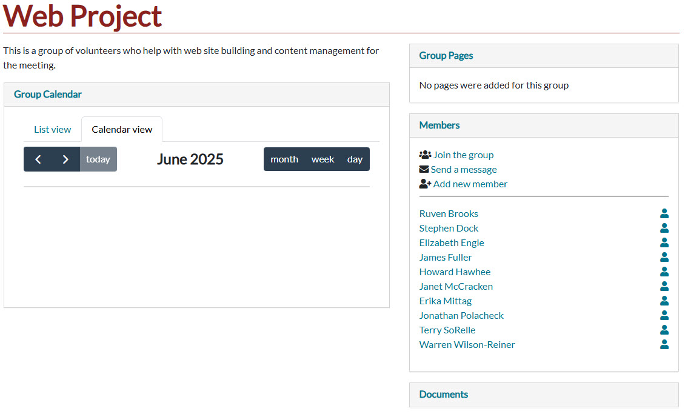
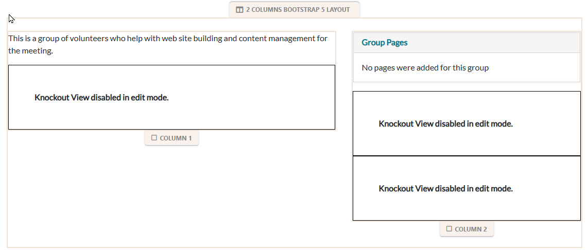
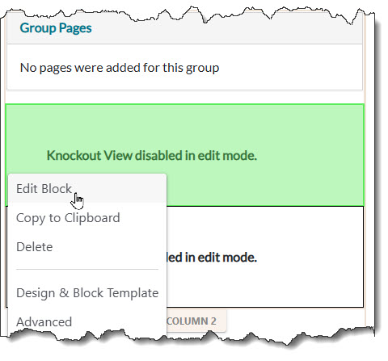
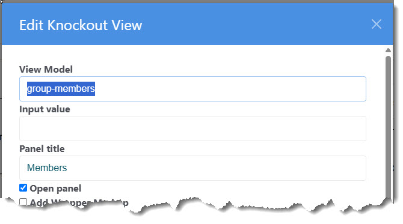
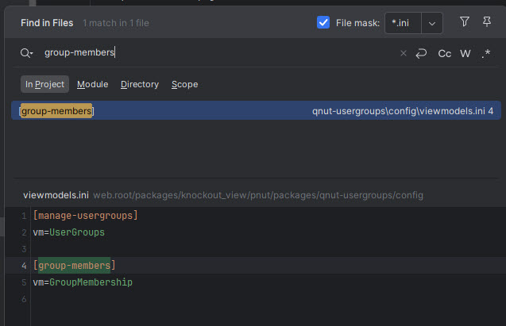
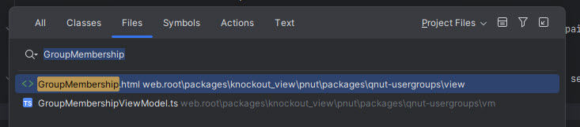
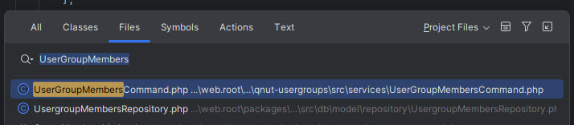

# Debugging and Maintaining a View Model
## How to find the code

For this example we want to locate the source code for the Group Page feature that allows the user to send email to the group.

First, examine the page:



The part we are concerned with is the collasible section on the right headed "Members".

Put the page in edit mode and see this:



Most "Peanut Host Pages" have a single Knockout View block, but Committee pages and Group pages have three.
The technique we'll show here works the same in all cases. But we do have to identify the knockout block that
contains the view model we want to modify.

Note: In this case we are using the term "View Model" as shorthand to refer to the View-Model\View pair a typescript
class and an HTML fragment page.  

The members block appears below the "Group Pages" block.  So, click the Knockout View block that is second from
bottom in Column 2. 



The key piece of information here is the "View Model" field.  In this case, containing the value "group-members".
This is the "View Model ID".  For convienence, copy this to your clipboard. Now we can leave ConcreteCMS
and go to the development IDE or editor.  In these example we use PHPStorm, but the principles are the same.



First, do a project wide search of INI files (*.ini) to find the viewmodel.ini containg a section for this view model
id.



We find in the peanut package directory "qnut-usergroups\config\viewmodels.ini".  All you need is the value indicated by
"vm=".  In this case "GroupMembership" is the "View Model Name".  Now we can search for the files "GroupMembershipViewModel.ts"
and "GroupMembership.html".

In PHPStorm, finding classes, files and other items is increadably easy.  Hightlight the word, "GroupMembership" in the
'Find in Files' dialog and Press the key combination Shift-Ctrl-N (or equivalent on Mackintosh, see the PHPStorm documentation),

Instantly you'll get a dialog referencing both. You can select both files and open them together.



If you do not have PHPStorm, you can search in your IDE/Editor and find one of these files.  The View (HTML) file will
be located in an .\view directory paralell to the .\vm directory where the *.ts file resides.  Not as convenient but not difficult.

Now with both files on your "work bench" you can begin your modification or fix. The most common of other files you may
need to locate are the service commands.  In your view model *.ts file (GroupMembershipViewModel.ts), look for the 
"executeService" statements:

```typescript
me.services.executeService('peanut.qnut-usergroups::UserGroupMembers', 
```
Again, PHPStorm makes it easy select the name for the service command ('UserGroupMembers') and press Shift-Ctrl-N as before.



If you need a more focused list, select the "Classes" tab.  In other IDE/Editors, do a similar search or you can decode 
the path part of the command reference.  In this case 'peanut.qnut-usergroups::' refers to the package directory for 
"packages/knockout_view/pnut/packages/qnut-usergroups/src/services"

For more information about service command location see: [service-commands.md](service-commands.md) or
[wheres-the-code.md](../notes/wheres-the-code.md)

Now you are ready to get to work.