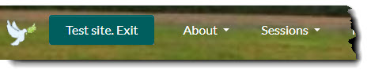

# Testing Sites

For AustinQuakers.org and SCYM.org, we offer testing sites for training and testing. These sites use an isolated database
to permit you to experiment with the system without affecting the production site. Email features are disabled on these sites
to prevent accidental email delivery to real users.

The test sites are:
- [https://testing.austiquakers.org](https://testing.austiquakers.org)
- [https://dev.scym.org](https://dev.scym.org)

If you are experimenting, be careful that you are on the testing site when you are making changes. There are two ways to tell.
1. Check the URL in your browser's address bar.  It should start with `https://testing.` or `https://dev.`
2. Look for this button to the left of the menu bar:
- On testing.AustinQuakers.org
  
- On dev.SCYM.org

Click the button if you want to return to the production site.

*Beware!* an erroneous link can switch you to the production site unexpectedly, So always double-check your location before making changes.
